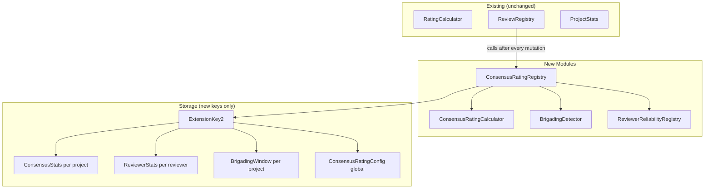

# Design Document: Consensus Rating

## Overview

The consensus rating feature extends the existing Bayesian rating system with a reliability-weighted layer that computes a more trustworthy project aggregate by down-weighting reviews from historically unreliable reviewers and auto-quarantining coordinated brigading bursts.

The design is **purely additive**: the existing `ProjectStats`, `RatingCalculator`, and all current entry points remain byte-for-byte identical. The new system lives entirely in new modules and new storage keys, surfaced through new contract entry points.

### Key Design Decisions

**Lazy consensus recomputation.** Updating a reviewer's reliability score across all projects they have ever reviewed would require an unbounded number of storage operations — one per project. Instead, consensus stats for a project are only recomputed when a review mutation occurs on *that* project. This bounds gas costs to O(N) where N is the number of non-quarantined reviewers on the project being mutated, not the total number of projects the reviewer has ever touched.

**`ExtensionKey2` is mandatory.** `ExtensionKey` currently has exactly 50 variants — the Soroban cap. All new storage keys for this feature must go into a new `ExtensionKey2` enum following the same pattern documented in `storage_keys.rs`.

**Weight floor of 1.** Every non-quarantined review contributes at least weight 1 regardless of how low its reviewer's reliability score falls. This prevents the edge case of a project's consensus rating being undefined because all its reviewers have zero weight.

**Brigading quarantine is reversible.** Admin-initiated `clear_brigading_flag` unlocks a quarantined review and triggers an immediate consensus recomputation. This gives admins an audit escape valve when the detector fires on legitimate coordinated community enthusiasm.

---

## Architecture

The feature introduces two new modules alongside the existing review and rating infrastructure:

```
dongle-smartcontract/src/
  consensus_rating/
    mod.rs               ← public re-exports
    calculator.rs        ← ConsensusRatingCalculator (pure math, no storage)
    registry.rs          ← ConsensusRatingRegistry (storage r/w, orchestration)
    brigading.rs         ← BrigadingDetector (outlier detection, quarantine)
    types.rs             ← ConsensusStats, ReviewerStats, ConsensusRatingConfig,
                            BrigadingWindow (new contracttypes)
```

The new `ExtensionKey2` enum is added to `storage_keys.rs`.



### Integration with `ReviewRegistry`

`ReviewRegistry::add_review`, `update_review`, `delete_review`, `hide_review`, and `restore_review` each call `ConsensusRatingRegistry::on_review_mutated(env, project_id)` after their own storage writes complete. This single hook handles:

1. Collecting all non-quarantined reviews for the project.
2. Running brigading detection on newly added reviews.
3. Recomputing and persisting `ConsensusStats`.
4. Recomputing and persisting each affected reviewer's `ReviewerStats`.

---

## Components and Interfaces

### `ConsensusRatingCalculator` (pure functions, no storage)

```rust
pub struct ConsensusRatingCalculator;

impl ConsensusRatingCalculator {
    /// Compute weighted average from a set of (rating, weight) pairs.
    /// Returns WEIGHTED_RATING_PRIOR_MEAN (350) when total_weight == 0.
    pub fn compute_consensus(reviews: &[(u32, u64)]) -> u32;

    /// Derive weight from reliability_score: max(1, reliability_score / 100).
    pub fn weight_from_score(reliability_score: u32) -> u64;

    /// Derive reliability_score from components: max(0, 10000 - accuracy_sum / total_reviews).
    pub fn score_from_components(accuracy_sum: u64, total_reviews: u32) -> u32;
}
```

### `ReviewerReliabilityRegistry` (storage r/w)

```rust
pub struct ReviewerReliabilityRegistry;

impl ReviewerReliabilityRegistry {
    /// Read or default ReviewerStats for an address.
    pub fn get_reviewer_stats(env: &Env, reviewer: &Address) -> Option<ReviewerStats>;

    /// Initialize stats for a reviewer's first review (total_reviews=1, accuracy_sum=0, score=5000).
    pub fn init_reviewer(env: &Env, reviewer: &Address);

    /// Decrement total_reviews; reset to neutral if it reaches 0.
    pub fn on_review_deleted(env: &Env, reviewer: &Address);

    /// Bulk-update accuracy_sum for all non-quarantined reviewers on a project
    /// given the new consensus_rating. Performs at most N+2 reads and N+1 writes.
    pub fn update_accuracy_for_project(
        env: &Env,
        project_id: u64,
        new_consensus_rating: u32,
    );
}
```

### `BrigadingDetector` (storage r/w)

```rust
pub struct BrigadingDetector;

impl BrigadingDetector {
    /// Inspect a newly submitted review. If it is an outlier, append it to
    /// the project's BrigadingWindow entry. If the window count exceeds the
    /// threshold, quarantine all candidates (unless trusted).
    /// Returns true if quarantine was triggered.
    pub fn inspect(
        env: &Env,
        project_id: u64,
        reviewer: &Address,
        rating: u32,
        consensus_rating: u32,
        config: &ConsensusRatingConfig,
    ) -> bool;

    /// Admin-only: clear the quarantine flag for a single review.
    pub fn clear_flag(env: &Env, project_id: u64, reviewer: &Address);

    /// Return addresses of all quarantined reviews for a project.
    pub fn get_quarantined(env: &Env, project_id: u64) -> Vec<Address>;

    /// Check whether a specific review is quarantined.
    pub fn is_quarantined(env: &Env, project_id: u64, reviewer: &Address) -> bool;
}
```

### `ConsensusRatingRegistry` (orchestration, storage r/w)

```rust
pub struct ConsensusRatingRegistry;

impl ConsensusRatingRegistry {
    /// Called by ReviewRegistry after every review mutation (add/update/delete/hide/restore).
    pub fn on_review_mutated(env: &Env, project_id: u64);

    /// Getter exposed as contract entry point.
    pub fn get_consensus_rating(env: &Env, project_id: u64) -> u32;

    /// Getter exposed as contract entry point.
    pub fn get_reviewer_stats(env: &Env, reviewer: Address) -> Option<ReviewerStats>;

    /// Getter exposed as contract entry point.
    pub fn get_quarantined_reviews(env: &Env, project_id: u64) -> Vec<Address>;

    /// Admin setter.
    pub fn set_consensus_rating_config(
        env: &Env,
        caller: Address,
        config: ConsensusRatingConfig,
    ) -> Result<(), ContractError>;

    /// Getter.
    pub fn get_consensus_rating_config(env: &Env) -> ConsensusRatingConfig;

    /// Admin: clear a brigading quarantine flag and recompute.
    pub fn clear_brigading_flag(
        env: &Env,
        admin: Address,
        project_id: u64,
        reviewer: Address,
    ) -> Result<(), ContractError>;
}
```

### New `lib.rs` Entry Points

```rust
// Getters
pub fn get_consensus_rating(env: Env, project_id: u64) -> u32
pub fn get_reviewer_stats(env: Env, reviewer: Address) -> Option<ReviewerStats>
pub fn get_quarantined_reviews(env: Env, project_id: u64) -> Vec<Address>
pub fn get_consensus_rating_config(env: Env) -> ConsensusRatingConfig

// Admin setters
pub fn set_consensus_rating_config(
    env: Env,
    caller: Address,
    config: ConsensusRatingConfig,
) -> Result<(), ContractError>

pub fn clear_brigading_flag(
    env: Env,
    admin: Address,
    project_id: u64,
    reviewer: Address,
) -> Result<(), ContractError>
```

---

## Data Models

### New Types (`consensus_rating/types.rs`)

```rust
#[contracttype]
#[derive(Clone, Debug, Eq, PartialEq)]
pub struct ReviewerStats {
    /// Total non-deleted reviews submitted by this reviewer.
    pub total_reviews: u32,
    /// Cumulative sum of |reviewer_rating * 100 - consensus_rating| across all
    /// projects this reviewer has reviewed (excluding quarantined reviews).
    pub accuracy_sum: u64,
    /// Derived score: max(0, 10000 - accuracy_sum / total_reviews). Range [0, 10000].
    pub reliability_score: u32,
}

#[contracttype]
#[derive(Clone, Debug, Eq, PartialEq)]
pub struct ConsensusStats {
    /// Sum of (weight_i * rating_i * 100) for non-quarantined reviews.
    pub weighted_sum: u64,
    /// Sum of weight_i for non-quarantined reviews.
    pub total_weight: u64,
    /// consensus_rating = weighted_sum / total_weight; 0 when no reviews.
    pub consensus_rating: u32,
    /// Count of currently quarantined reviews for this project.
    pub quarantined_count: u32,
}

#[contracttype]
#[derive(Clone, Debug, Eq, PartialEq)]
pub struct ConsensusRatingConfig {
    /// Rating deviation (scaled by 100) beyond which a review is an outlier candidate.
    /// Default: 200 (= 2.00 stars).
    pub outlier_threshold: u32,
    /// Time window in seconds for brigading burst detection. Default: 86400 (24 h).
    pub brigading_window_seconds: u64,
    /// Number of outlier candidates within the window that triggers a quarantine.
    /// Default: 5.
    pub brigading_count_threshold: u32,
    /// Reviewers with reliability_score above this value are immune to quarantine.
    /// Default: 8000.
    pub trusted_reviewer_score_threshold: u32,
}

/// Compacted per-project record of outlier candidates within the current brigading window.
/// Stored as a single ledger entry to bound storage growth.
#[contracttype]
#[derive(Clone, Debug, Eq, PartialEq)]
pub struct BrigadingWindow {
    /// Reviewer addresses of outlier candidates in the current window.
    pub candidates: Vec<Address>,
    /// Submission timestamps for each candidate (parallel to `candidates`).
    pub timestamps: Vec<u64>,
    /// Start of the current detection window (oldest candidate timestamp).
    pub window_start: u64,
}

/// Event emitted when a brigading burst is first detected for a project.
#[contracttype]
#[derive(Clone, Debug, Eq, PartialEq)]
pub struct BrigadingDetectedEvent {
    pub project_id: u64,
    pub quarantined_count: u32,
    pub detection_timestamp: u64,
}
```

### `ExtensionKey2` (new enum in `storage_keys.rs`)

```rust
/// Storage keys for the consensus-rating feature.
/// ExtensionKey is at 50 variants (the Soroban cap); all new keys go here.
#[contracttype]
#[derive(Clone, Debug, Eq, PartialEq)]
pub enum ExtensionKey2 {
    /// Per-reviewer accuracy and reliability stats.
    ReviewerStats(Address),
    /// Per-project consensus rating aggregate.
    ConsensusStats(u64),
    /// Per-project brigading detection window (single compacted entry).
    BrigadingWindow(u64),
    /// Per-review quarantine flag: (project_id, reviewer) -> bool.
    ReviewQuarantine(u64, Address),
    /// Global consensus rating configuration.
    ConsensusRatingConfig,
}
```

Five new variants — well within the 50-variant cap for `ExtensionKey2`.

---

## Correctness Properties

*A property is a characteristic or behavior that should hold true across all valid executions of a system — essentially, a formal statement about what the system should do. Properties serve as the bridge between human-readable specifications and machine-verifiable correctness guarantees.*

### Property 1: Reviewer stats score formula consistency

*For any* stored `ReviewerStats` with `total_reviews > 0`, `reliability_score` must equal `max(0, 10000 - accuracy_sum / total_reviews)`.

**Validates: Requirements 1.4, 1.7**

### Property 2: Consensus rating formula consistency

*For any* `ConsensusStats` record with `total_weight > 0`, `consensus_rating` must equal `weighted_sum / total_weight`.

**Validates: Requirements 2.1, 2.8**

### Property 3: Weight floor invariant

*For any* non-quarantined review with any `reliability_score` in [0, 10000], the computed weight must be `max(1, reliability_score / 100)`, which is always ≥ 1.

**Validates: Requirements 2.2**

### Property 4: Empty project returns prior mean

*For any* project with zero non-quarantined reviews, `get_consensus_rating` must return 350 (the Bayesian prior mean).

**Validates: Requirements 2.3, 6.3**

### Property 5: Outlier detection threshold

*For any* review rating and consensus rating where `|review_rating * 100 - consensus_rating| > outlier_threshold`, the review must be recorded as an outlier candidate.

**Validates: Requirements 3.2**

### Property 6: Brigading quarantine triggers when threshold exceeded

*For any* project where the number of outlier candidates within the brigading window exceeds `brigading_count_threshold`, all those candidates must be marked `quarantined = true` (except trusted reviewers with `reliability_score > trusted_reviewer_score_threshold`).

**Validates: Requirements 3.3, 3.5**

### Property 7: Quarantined reviews contribute zero weight

*For any* project, the `ConsensusStats.weighted_sum` must equal the sum of `weight(reviewer) * rating * 100` only over non-quarantined reviews; quarantined reviews must not appear in the sum.

**Validates: Requirements 3.4**

### Property 8: Clear flag restores contribution and updates consensus

*For any* quarantined review, after `clear_brigading_flag` is called by an admin, `is_quarantined` must return `false` for that review and `ConsensusStats` must be updated to include that review's contribution.

**Validates: Requirements 3.7**

### Property 9: Config round-trip

*For any* valid `ConsensusRatingConfig`, calling `set_consensus_rating_config` followed by `get_consensus_rating_config` must return a config with identical field values.

**Validates: Requirements 4.3**

### Property 10: Admin-only config enforcement

*For any* address that is not a registered admin, calling `set_consensus_rating_config` must return `ContractError::AdminOnly`.

**Validates: Requirements 4.4**

### Property 11: Reviewer deletion round-trip

*For any* reviewer with `total_reviews = 1`, deleting their review must result in the registry resetting the reviewer's stats to neutral values (total_reviews = 0 or reset to initial).

*For any* reviewer with `total_reviews > 1`, deleting one review must decrement `total_reviews` by exactly 1.

**Validates: Requirements 1.5**

---

## Error Handling

New error codes are added to `ContractError` in `errors.rs`:

| Code | Name | When raised |
|------|------|-------------|
| 82 | `ReviewAlreadyClearFlagged` | Admin calls `clear_brigading_flag` on a review that is not quarantined |
| 83 | `ConsensusConfigInvalid` | `set_consensus_rating_config` receives an invalid config (e.g., `brigading_count_threshold = 0`) |

Existing errors reused:
- `ContractError::AdminOnly` — non-admin calls `set_consensus_rating_config` or `clear_brigading_flag`.
- `ContractError::ReviewNotFound` — `clear_brigading_flag` targets a non-existent review.
- `ContractError::ProjectNotFound` — any operation targets a non-existent project.

### Arithmetic Safety

All weighted-sum accumulations use `saturating_add`/`saturating_mul` consistent with the existing `RatingCalculator` convention. The maximum `total_weight` for a project is bounded by `MAX_REVIEWS_PER_PROJECT * max_weight_per_review = 20_000 * 100 = 2_000_000`, which fits safely in a `u64`.

---

## Testing Strategy

### Unit Tests

Unit tests cover:

- `ConsensusRatingCalculator::compute_consensus` with zero reviews, one review, and mixed quarantined/non-quarantined sets.
- `ConsensusRatingCalculator::weight_from_score` boundary values: score = 0 → weight 1, score = 100 → weight 1, score = 101 → weight 1, score = 10000 → weight 100.
- `ConsensusRatingCalculator::score_from_components` boundary values: `total_reviews = 0` (guard), large `accuracy_sum` (clamp to 0).
- `BrigadingDetector::inspect` with a burst exactly at the threshold (no quarantine) and one above (quarantine triggered).
- `clear_brigading_flag` on a non-quarantined review returns `ReviewAlreadyClearFlagged`.
- Backward compatibility: `get_project_stats` and `get_weighted_rating` continue to return unchanged values after consensus operations.

### Property-Based Tests (proptest)

The project already uses `proptest`. New property tests are added to `consensus_rating/mod.rs` under a `prop_tests` submodule. Each test runs a minimum of 100 iterations.

```
// Feature: consensus-rating, Property 1: score formula consistency
// Feature: consensus-rating, Property 2: consensus rating formula consistency
// Feature: consensus-rating, Property 3: weight floor invariant
// Feature: consensus-rating, Property 5: outlier detection threshold
// Feature: consensus-rating, Property 9: config round-trip
// Feature: consensus-rating, Property 10: admin-only config enforcement
// Feature: consensus-rating, Property 11: reviewer deletion round-trip
```

Properties 4, 6, 7, and 8 require full contract context and are covered by integration-style unit tests within the Soroban test environment using `Env::default()`.

### Integration Tests

A new test file `dongle-smartcontract/src/tests/consensus_rating.rs` covers end-to-end scenarios:

- Full brigading burst: 6 outlier reviews from separate addresses in a 24-hour window → all quarantined, event emitted, consensus excludes them.
- Trusted reviewer immunity: reviewer with score 8500 submits an outlier → not quarantined.
- Admin clears flag → consensus updates.
- Legacy project (no `ConsensusStats`) → `get_consensus_rating` returns 350 without panic.
- Existing `get_project_stats` and `get_weighted_rating` calls on a project with consensus data return their original values unchanged.
