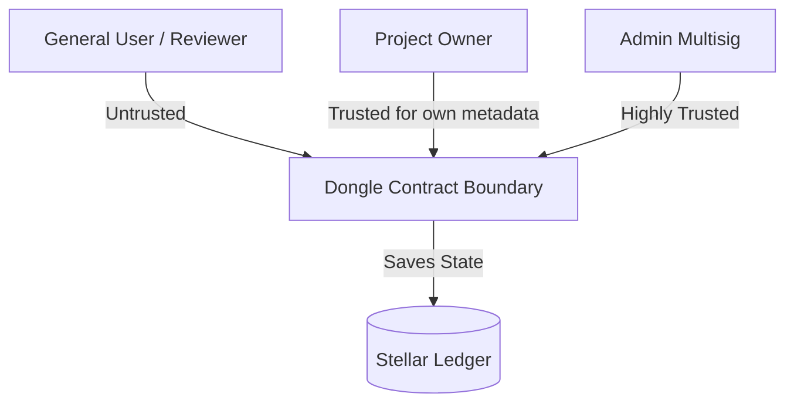

# Dongle Smart Contract Threat Model

This document outlines the security architecture, trust assumptions, assets, actors, threat analysis, and mitigations for the Dongle smart contract.

---

## 1. System Assets

1. **Project Registry State:** The integrity of project ownership, names, slugs, and associated metadata (website, description, tags, social links).
2. **Review & Rating Data:** The validity of reviews, individual ratings, aggregated statistics (average ratings, total counts), and flag counts.
3. **Escrowed / Paid Fees:** Token balances paid for registration or verification, held in the contract or directed to the configured treasury.
4. **Administrative Credentials:** The set of authorized admin addresses and the parameters governing multisig execution thresholds and timelocks.

---

## 2. Actors & Trust Boundaries

* **Project Owner:** An external Stellar account that registers a project. Trusted only to modify their own project metadata.
* **Reviewer / General User:** Any external Stellar account that reads/writes reviews, follows, or bookmarks projects. Untrusted.
* **Admins:** A set of trusted accounts authorized to manage contract configuration and perform moderation. Trust is distributed across multiple admins using an on-chain multisig proposal system.
* **Smart Contract Boundary:** All entry points validate authentication via `Address::require_auth()`.

---

## 3. Threat Analysis & Abuse Cases

### A. Impersonation and Metadata Tampering
* **Threat:** An attacker registers a project using the name/slug of a popular external project to divert traffic or conduct phishing. Or, a hacker modifies metadata of an existing legitimate project.
* **Mitigation:** 
  - `require_auth()` prevents unauthorized metadata changes. Only the registered project owner (or authorized maintainers) can invoke `update_project`.
  - **Uniqueness Constraints:** Slugs and names are verified for uniqueness upon registration and updates. Once a slug is registered, it cannot be claimed by another project.
  - **Verified Field Freezing:** Once a project is verified by admins (`VerificationStatus::Verified`), its identity-critical fields (`name`, `slug`, `category`, `logo_cid`, `metadata_cid`) are frozen. They cannot be updated by the owner unless the verification is revoked first.

### B. Spam and Sybil Attacks
* **Threat:** An attacker registers thousands of fake projects or writes thousands of fake reviews to skew averages, manipulate rankings, or bloat ledger state.
* **Mitigation:**
  - **Registration & Verification Fees:** Admins can configure non-zero fee requirements for registration and verification to make spam financially expensive.
  - **Ownership Limits:** A strict limit (`MAX_PROJECTS_PER_USER`) restricts the number of active projects a single Stellar address can register.
  - **Moderation:** Admins can flag and hide/delete reviews that are determined to be abusive or spam. General users can report reviews to trigger admin inspection.

### C. Admin Abuse and Collusion
* **Threat:** A compromised or malicious admin single-handedly alters fee rates, routes treasury funds to a private key, or falsely approves/revokes project verifications.
* **Mitigation:**
  - **Multisig Governance:** Highly sensitive administrative actions (adding/removing admins, changing fees, setting thresholds) cannot be executed by a single admin. They require submitting a formal `AdminProposal` and gathering approvals up to a defined threshold (`threshold`).
  - **Timelock Delay:** Changes to critical parameters (like fee configuration updates) require scheduling via a timelock, introducing a delay that allows users to notice and react before changes take effect.

---

## 4. Unresolved Risks & Trust Assumptions

1. **IPFS / Off-Chain Data Availability:** 
   - *Risk:* Review contents, descriptions, and verification evidence are stored as CIDs (IPFS hashes). The contract cannot guarantee that the off-chain content behind these CIDs is pinned, accessible, or matches the schema.
   - *Assumption:* Indexers and frontends must handle missing or slow CID resolution gracefully.
2. **Admin Collusion:**
   - *Risk:* If a threshold of admins colludes, they can override any constraint, approve malicious projects, or arbitrarily set exorbitant fees.
   - *Assumption:* The admin keys are held by separate, independent entities, and their private keys are secured.
3. **Off-Chain Identity Verification Diligence:**
   - *Risk:* Verification approval depends on the manual, off-chain diligence of admins confirming that the requester owns the project. If admins perform poor validation, incorrect verifications can occur.
