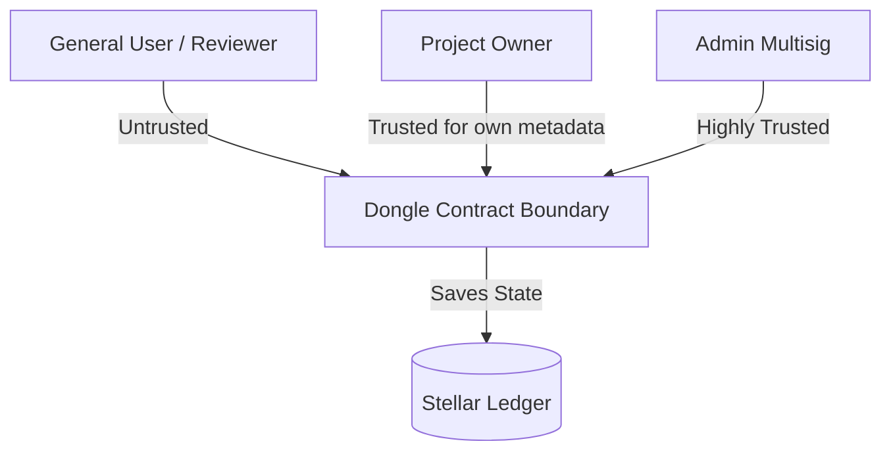

# Dongle Smart Contract Threat Model

This document outlines the security architecture, trust assumptions, assets, actors, threat analysis, and mitigations for the Dongle smart contract.

---

## 1. System Assets

1. **Project Registry State:** The integrity of project ownership, names, slugs, and associated metadata (website, description, tags, social links).
2. **Review & Rating Data:** The validity of reviews, individual ratings, aggregated statistics (average ratings, total counts), and flag counts.
3. **Escrowed / Paid Fees:** Token balances paid for registration or verification, held in the contract or directed to the configured treasury.
4. **Administrative Credentials:** The set of authorized admin addresses and the parameters governing multisig execution thresholds and timelocks.

---

## 2. Actors & Trust Boundaries

* **Project Owner:** An external Stellar account that registers a project. Trusted only to modify their own project metadata.
* **Reviewer / General User:** Any external Stellar account that reads/writes reviews, follows, or bookmarks projects. Untrusted.
* **Admins:** A set of trusted accounts authorized to manage contract configuration and perform moderation. Trust is distributed across multiple admins using an on-chain multisig proposal system.
* **Smart Contract Boundary:** All entry points validate authentication via `Address::require_auth()`.


```mermaid
graph TD
    User[General User / Reviewer] -->|Untrusted| Contract[Dongle Contract Boundary]
    Owner[Project Owner] -->|Trusted for own metadata| Contract
    Admins[Admin Multisig] -->|Highly Trusted| Contract
    Contract -->|Saves State| Ledger[(Stellar Ledger)]
```

---

## 3. Threat Analysis & Abuse Cases

### A. Impersonation and Metadata Tampering
* **Threat:** An attacker registers a project using the name/slug of a popular external project to divert traffic or conduct phishing. Or, a hacker modifies metadata of an existing legitimate project.
* **Mitigation:** 
  - `require_auth()` prevents unauthorized metadata changes. Only the registered project owner (or authorized maintainers) can invoke `update_project`.
  - **Uniqueness Constraints:** Slugs and names are verified for uniqueness upon registration and updates. Once a slug is registered, it cannot be claimed by another project.
  - **Verified Field Freezing:** Once a project is verified by admins (`VerificationStatus::Verified`), its identity-critical fields (`name`, `slug`, `category`, `logo_cid`, `metadata_cid`) are frozen. They cannot be updated by the owner unless the verification is revoked first.

### B. Spam and Sybil Attacks
* **Threat:** An attacker registers thousands of fake projects or writes thousands of fake reviews to skew averages, manipulate rankings, or bloat ledger state.
* **Mitigation:**
  - **Registration & Verification Fees:** Admins can configure non-zero fee requirements for registration and verification to make spam financially expensive.
  - **Ownership Limits:** A strict limit (`MAX_PROJECTS_PER_USER`) restricts the number of active projects a single Stellar address can register.
  - **Moderation:** Admins can flag and hide/delete reviews that are determined to be abusive or spam. General users can report reviews to trigger admin inspection.

### C. Admin Abuse and Collusion
* **Threat:** A compromised or malicious admin single-handedly alters fee rates, routes treasury funds to a private key, or falsely approves/revokes project verifications.
* **Mitigation:**
  - **Multisig Governance:** Highly sensitive administrative actions (adding/removing admins, changing fees, setting thresholds) cannot be executed by a single admin. They require submitting a formal `AdminProposal` and gathering approvals up to a defined threshold (`threshold`).
  - **Timelock Delay:** Changes to critical parameters (like fee configuration updates) require scheduling via a timelock, introducing a delay that allows users to notice and react before changes take effect.

---

## 4. Panic-as-Denial-of-Service (DoS) Risk

### Threat Description

A panic condition in Soroban contracts terminates execution and can be exploited by an attacker to trigger contract halts. If panic call sites are reachable from external entry points via untrusted inputs (e.g., malformed data, adversarial registry state, or out-of-bounds operations), an attacker can cause a denial of service by crafting inputs that trigger the panic.

### Affected Components

The following modules contain panic/unwrap/expect call sites reachable from external entry points:

#### 1. **Timelock Manager** (`src/timelock_manager.rs`)
- **Lines 49, 52:** Panic on invalid execution timestamp (future timestamp and minimum delay validation)
  ```rust
  panic!("Timelock: execution timestamp must be in the future");
  panic!("Timelock: minimum delay not met");
  ```
- **Line 60:** `unwrap_or_else(|| panic!(...))` when action not found
  ```rust
  .unwrap_or_else(|| panic!("Timelock: action not found"))
  ```
- **Lines 74, 77, 85:** Panic on invalid action state (already executed, already cancelled, timelock not expired)
  ```rust
  panic!("Timelock: action already executed");
  panic!("Timelock: action already cancelled");
  panic!("Timelock: action cannot execute before timelock expires");
  ```
- **Lines 268, 300, 325:** `.expect()` calls on storage retrieval that may fail if data is corrupted or missing
  ```rust
  .expect("Timelock: fee params not found");
  .expect("Timelock: admin add params not found");
  .expect("Timelock: admin remove params not found");
  ```

**Entry Point:** `execute_timelock_action()` (publicly callable)

#### 2. **Endorsement Registry** (`src/endorsement_registry.rs`)
- **Line 26:** Panic when project not found
  ```rust
  panic!("project not found");
  ```

**Entry Point:** Endorsement operations reachable from external users

#### 3. **Bookmark Registry** (`src/bookmark_registry.rs`)
- **Line 28:** Panic when project not found
  ```rust
  panic!("project not found");
  ```

**Entry Point:** Bookmark operations reachable from external users

#### 4. **Dependency Registry** (`src/dependency_registry.rs`)
- **Lines 100, 111, 122, 130:** `.unwrap()` on UTF-8 string conversion
  ```rust
  let key_str = core::str::from_utf8(&buf[..4 + num_len]).unwrap();
  let key_str = core::str::from_utf8(&buf[..4 + cid_len as usize]).unwrap();
  let key_str = core::str::from_utf8(&buf[..4 + url_len as usize]).unwrap();
  let key_str = core::str::from_utf8(&buf[..60]).unwrap();
  ```

**Risk:** If buffer slicing logic is incorrect, UTF-8 parsing can fail and trigger panic.

#### 5. **Review Registry** (`src/review_registry.rs`)
- **Lines 1074, 1075:** `.unwrap()` on Vec access without bounds checking
  ```rust
  let a = all.get(j).unwrap();
  let b = all.get(j + 1).unwrap();
  ```

**Risk:** Out-of-bounds access if vector size assumptions are violated.

#### 6. **Project Registry** (`src/project_registry.rs`)
- **Lines 1973, 1974:** `.unwrap()` on Vec access without bounds checking
  ```rust
  let a = all.get(j).unwrap();
  let b = all.get(j + 1).unwrap();
  ```

**Risk:** Out-of-bounds access if vector size assumptions are violated.

#### 7. **Admin Manager** (`src/admin_manager.rs`)
- **Line 23:** Panic on re-initialization
  ```rust
  panic!("Contract already initialized");
  ```

**Risk:** If initialization state is corrupted, attacker may trigger panic.

### Mitigation Strategy

1. **Replace panic/unwrap with error returns:**
   - Convert all `panic!()`, `unwrap()`, and `expect()` calls to use `Result<T, ContractError>` returns
   - Handle errors gracefully with appropriate error variants in `src/errors.rs`

2. **Bounds checking:**
   - Verify vector/array indices before access using `.get()` instead of direct indexing
   - Add length assertions with error returns, not panics

3. **UTF-8 validation:**
   - Use `.unwrap_or_else()` with fallback logic, or validate buffer contents before UTF-8 conversion
   - Return `ContractError` on malformed UTF-8, do not panic

4. **Storage invariants:**
   - Use `.ok_or(ContractError::...)` instead of `.expect()` for storage retrievals
   - Add assertions to validate storage consistency at entry points

5. **Verification and testing:**
   - Add property-based tests (proptest) to fuzz inputs and verify no panic conditions are reachable
   - Use fuzzing tools to systematically test entry points with malformed data
   - Add doc tests with panic-triggering inputs to catch regressions

### Related Issues

- **Issue #XXX:** Replace panics in timelock_manager.rs with error returns
- **Issue #XXX:** Replace panics in endorsement_registry.rs with error returns
- **Issue #XXX:** Replace panics in bookmark_registry.rs with error returns
- **Issue #XXX:** Fix UTF-8 unwraps in dependency_registry.rs
- **Issue #XXX:** Fix vector bounds panics in review_registry.rs
- **Issue #XXX:** Fix vector bounds panics in project_registry.rs
- **Issue #XXX:** Harden admin_manager initialization checks

---

## 5. Unresolved Risks & Trust Assumptions

1. **IPFS / Off-Chain Data Availability:** 
   - *Risk:* Review contents, descriptions, and verification evidence are stored as CIDs (IPFS hashes). The contract cannot guarantee that the off-chain content behind these CIDs is pinned, accessible, or matches the schema.
   - *Assumption:* Indexers and frontends must handle missing or slow CID resolution gracefully.
2. **Admin Collusion:**
   - *Risk:* If a threshold of admins colludes, they can override any constraint, approve malicious projects, or arbitrarily set exorbitant fees.
   - *Assumption:* The admin keys are held by separate, independent entities, and their private keys are secured.
3. **Off-Chain Identity Verification Diligence:**
   - *Risk:* Verification approval depends on the manual, off-chain diligence of admins confirming that the requester owns the project. If admins perform poor validation, incorrect verifications can occur.
