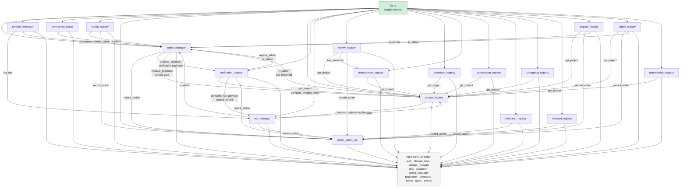
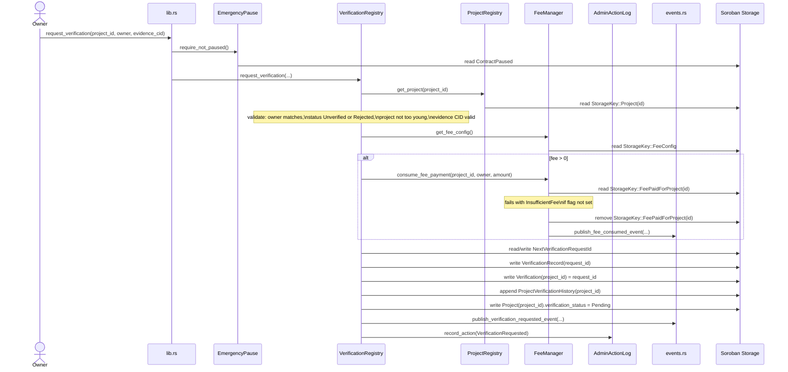
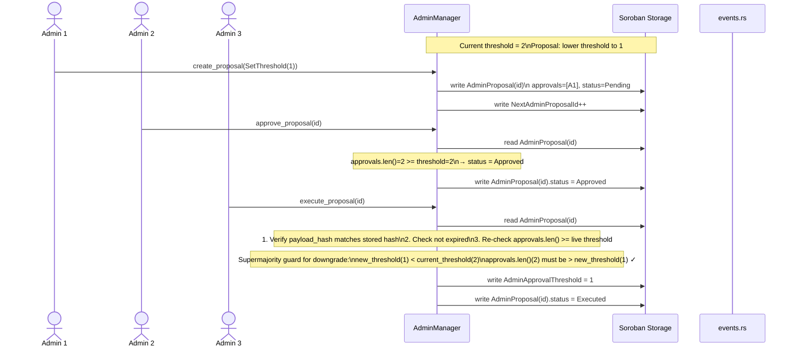

# Architecture Overview

This document describes the module structure, data flows, and inter-module dependencies
of the Dongle Smart Contract. It is aimed at new contributors who want to understand
how the codebase fits together before diving into individual files.

---

## Table of Contents

1. [High-level structure](#1-high-level-structure)
2. [Module dependency diagram](#2-module-dependency-diagram)
3. [Call flow: request_verification (happy path)](#3-call-flow-request_verification-happy-path)
4. [Call flow: multi-sig governance proposal](#4-call-flow-multi-sig-governance-proposal)
5. [Storage layout](#5-storage-layout)
6. [Event taxonomy](#6-event-taxonomy)
7. [Module reference](#7-module-reference)
8. [Pagination conventions](#8-pagination-conventions)

---

## 1. High-level structure

The contract is a single Soroban `#[contract]` (`DongleContract` in `lib.rs`).
Every public entry-point is a thin delegating wrapper — no business logic lives
in `lib.rs` itself.  The ~20 modules underneath it fall into four natural layers:

```
┌─────────────────────────────────────────────────────────────────────────────┐
│                         lib.rs  (DongleContract)                            │
│         single entry-point struct; delegates 100 % to domain modules        │
└────────────────────────────────┬────────────────────────────────────────────┘
                                 │
         ┌───────────────────────┼───────────────────────┐
         ▼                       ▼                       ▼
┌─────────────────┐   ┌─────────────────────┐   ┌───────────────────────────┐
│   GOVERNANCE     │   │   CORE DOMAIN        │   │   COMMUNITY / SOCIAL      │
│                 │   │                     │   │                           │
│ admin_manager   │   │ project_registry    │   │ review_registry           │
│ timelock_manager│   │ verification_       │   │ bookmark_registry         │
│ emergency_pause │   │   registry          │   │ endorsement_registry      │
│ config_registry │   │ fee_manager         │   │ subscription_registry     │
│ admin_action_log│   │                     │   │ collection_registry       │
└────────┬────────┘   └────────┬────────────┘   │ changelog_registry        │
         │                     │                │ featured_registry         │
         │                     │                │ dispute_registry          │
         │                     │                │ report_registry           │
         │                     │                │ dependency_registry       │
         └──────────┬──────────┘                └───────────────────────────┘
                    │
         ┌──────────▼──────────────────────────────────────────────────────┐
         │                     INFRASTRUCTURE                               │
         │  auth  ·  storage_keys  ·  storage_manager  ·  pagination       │
         │  utils  ·  validation  ·  rating_calculator  ·  constants        │
         │  errors  ·  types  ·  events                                     │
         └─────────────────────────────────────────────────────────────────┘
```

Key invariants:
- **Every mutating call** (except admin-only endpoints) goes through
  `EmergencyPause::require_not_paused()` in `lib.rs` before reaching any module.
- **Auth is centralized** in `auth.rs` (`require_admin_auth`, `require_owner_auth`,
  `require_self_auth`). Modules never call `caller.require_auth()` directly except
  through these helpers.
- **Storage keys are centralized** in `storage_keys.rs` (`StorageKey` enum for the
  first 50 variants, `ExtensionKey` for the overflow).  No module defines its own
  ad-hoc keys.
- **Events are centralized** in `events.rs`.  All `publish_*` functions live there;
  no module constructs raw event topics.

---

## 2. Module dependency diagram

The diagram below shows which modules call into which others.  Infrastructure
modules (`auth`, `storage_keys`, `storage_manager`, `types`, `errors`, `events`,
`constants`, `utils`, `pagination`, `rating_calculator`, `validation`) are used
by almost every module and are omitted from individual edges to keep the graph
readable — they are shown as a shared foundation block at the bottom.



---

## 3. Call flow: request_verification (happy path)

This is the most complex happy-path flow in the contract — it crosses five modules.



---

## 4. Call flow: multi-sig governance proposal

Shows how a threshold-2 `SetThreshold` proposal travels from creation to execution,
including the supermajority downgrade guard.



---

## 5. Storage layout

Storage is split across two enums to stay under Soroban's 50-variant
`#[contracttype]` limit.

### 5a. StorageKey (primary — 50 variants)

| Key pattern | Holds | Written by |
|---|---|---|
| `Project(u64)` | `Project` struct | ProjectRegistry |
| `ProjectCount` | `u64` | ProjectRegistry |
| `ProjectByName(String)` | `u64` (project ID) | ProjectRegistry |
| `ProjectBySlug(String)` | `u64` | ProjectRegistry |
| `OwnerProjects(Address)` | `Vec<u64>` | ProjectRegistry |
| `ActiveOwnerProjects(Address)` | `Vec<u64>` | ProjectRegistry |
| `OwnerProjectCount(Address)` | `u32` | ProjectRegistry |
| `CategoryProjects(String)` | `Vec<u64>` | ProjectRegistry |
| `ProjectLifecycleStatus(u64)` | `ProjectLifecycleStatus` | ProjectRegistry |
| `ProjectTags(u64)` | `Vec<String>` | ProjectRegistry |
| `ProjectSocialLinks(u64)` | `Map<String,String>` | ProjectRegistry |
| `ProjectBountyUrl(u64)` | `String` | ProjectRegistry |
| `ProjectMaintainers(u64)` | `Vec<Address>` | ProjectRegistry |
| `ProjectLinkedProjects(u64)` | `Vec<u64>` | ProjectRegistry |
| `PendingTransfer(u64)` | `Address` (recipient) | ProjectRegistry |
| `Verification(u64)` | `u64` (latest request_id) | VerificationRegistry |
| `NextVerificationRequestId` | `u64` | VerificationRegistry |
| `VerificationRecord(u64)` | `VerificationRecord` | VerificationRegistry |
| `ProjectVerificationHistory(u64)` | `Vec<u64>` | VerificationRegistry |
| `VerificationRenewal(u64)` | `VerificationRenewalRecord` | VerificationRegistry |
| `VerificationRenewalHistory(u64, u32)` | `VerificationRenewalRecord` | VerificationRegistry |
| `VerificationRenewalCount(u64)` | `u32` | VerificationRegistry |
| `VerificationDuration` | `u64` (seconds) | AdminManager |
| `MinProjectAge` | `u64` (seconds) | VerificationRegistry |
| `FeeConfig` | `FeeConfig` | FeeManager |
| `Treasury` | `Address` | FeeManager |
| `FeePaidForProject(u64)` | `bool` (consumed on use) | FeeManager |
| `RegistrationFeePaidForAddress(Address)` | `bool` | FeeManager |
| `Admin(Address)` | `bool` | AdminManager |
| `AdminList` | `Vec<Address>` | AdminManager |
| `ProjectStats(u64)` | `ProjectStats` | ReviewRegistry |
| `Review(u64, Address)` | `Review` | ReviewRegistry |
| `ProjectReviews(u64)` | `Vec<Address>` | ReviewRegistry |
| `UserReviews(Address)` | `Vec<u64>` | ReviewRegistry |
| `ReviewsEnabled(u64)` | `bool` | ReviewRegistry |
| `ReviewReport(u64, Address, Address)` | `bool` (dedup) | ReviewRegistry / ReportRegistry |
| `ProjectReports(u64)` | `Vec<ProjectReport>` | ReportRegistry |
| `ProjectReportCount(u64)` | `u32` | ReportRegistry |
| `UserReport(u64, Address)` | `bool` (dedup) | ReportRegistry |
| `FeaturedProjects` | `Vec<u64>` | FeaturedRegistry |
| `Collection(u64)` | `Collection` | CollectionRegistry |
| `CollectionNameById(u64)` | `String` | CollectionRegistry |
| `NextCollectionId` | `u64` | CollectionRegistry |
| `CollectionList` | `Vec<u64>` | CollectionRegistry |
| `CollectionProjectIds(u64)` | `Vec<u64>` | CollectionRegistry |
| `AdminActionLog(u64)` | `AdminActionEntry` | AdminActionLog |
| `AdminActionLogCount` | `u64` | AdminActionLog |
| `ContractPaused` | `bool` | EmergencyPause |

### 5b. ExtensionKey (overflow)

| Key pattern | Holds | Written by |
|---|---|---|
| `AdminApprovalThreshold` | `u32` | AdminManager |
| `AdminProposal(u64)` | `AdminProposal` | AdminManager |
| `AdminProposalIds` | `Vec<u64>` | AdminManager |
| `NextAdminProposalId` | `u64` | AdminManager |
| `FeePaymentDetails(u64)` | `FeePaymentRecord` (audit, not consumed) | FeeManager |
| `RegistrationFeePaymentDetails(Address)` | `FeePaymentRecord` | FeeManager |
| `FeeRefund(u64)` | `FeeRefundRecord` | FeeManager |
| `TimelockAction(u64)` | `TimelockAction` | TimelockManager |
| `TimelockActionIds` | `Vec<u64>` | TimelockManager |
| `NextTimelockActionId` | `u64` | TimelockManager |
| `TimelockFeeParams(u64)` | `TimelockFeeParams` | TimelockManager |
| `TimelockAdminAddParams(u64)` | `TimelockAdminAddParams` | TimelockManager |
| `TimelockAdminRemoveParams(u64)` | `TimelockAdminRemoveParams` | TimelockManager |
| `UserBookmarks(Address)` | `Vec<u64>` | BookmarkRegistry |
| `ProjectFollowers(u64)` | `Vec<Address>` | SubscriptionRegistry |
| `UserSubscriptions(Address)` | `Vec<u64>` | SubscriptionRegistry |
| `FollowerCount(u64)` | `u32` | SubscriptionRegistry |
| `ProjectEndorsements(u64)` | `Vec<Address>` | EndorsementRegistry |
| `EndorsementCount(u64)` | `u32` | EndorsementRegistry |
| `ProjectRegion(u64)` | `String` | ProjectRegistry |
| `ProjectIntegrityHash(u64)` | `BytesN<32>` (SHA-256) | ProjectRegistry |
| `ProjectByNormalizedName(String)` | `u64` | ProjectRegistry |
| `ReservedNames` | `Vec<String>` | ProjectRegistry |
| `ClaimRequest(u64)` | `ClaimRequest` | ProjectRegistry |
| `ClaimReqProjClaimant(u64, Address)` | `ClaimRequest` (dedup) | ProjectRegistry |
| `ProjectClaimRequests(u64)` | `Vec<u64>` | ProjectRegistry |
| `NextClaimRequestId` | `u64` | ProjectRegistry |
| `ContractClaim(u64, String)` | `ContractClaimRequest` | ProjectRegistry |
| `ProjectContracts(u64)` | `Vec<String>` | ProjectRegistry |
| `ProjectDependency(u64, String)` | `ProjectDependency` | DependencyRegistry |
| `ProjectDependencyKeys(u64)` | `Vec<String>` | DependencyRegistry |
| `DuplicateDispute(u64)` | `DuplicateDispute` | DisputeRegistry |
| `ProjectDuplicateDisputes(u64)` | `Vec<u64>` | DisputeRegistry |
| `NextDuplicateDisputeId` | `u64` | DisputeRegistry |
| `NextChangelogEntryId` | `u64` | ChangelogRegistry |
| `ProjectChangelogEntry(u64)` | `ChangelogEntry` | ChangelogRegistry |
| `ProjectChangelogEntries(u64)` | `Vec<u64>` | ChangelogRegistry |
| `ReviewTombstone(u64, Address)` | `ReviewTombstone` | ReviewRegistry |
| `ReviewLastUpdated(u64, Address)` | `u64` (cooldown timestamp) | ReviewRegistry |
| `ReviewEligibilityConfig` | `ReviewEligibilityConfig` | ReviewRegistry |
| `FirstInteraction(Address)` | `u64` | ReviewRegistry |
| `ReviewRevisionCount(u64, Address)` | `u32` | ReviewRegistry |
| `ReviewRevision(u64, Address, u32)` | `ReviewRevision` | ReviewRegistry |
| `AdminActionLogByAdmin(Address)` | `Vec<u64>` | AdminActionLog |

---

## 6. Event taxonomy

Events are grouped by domain prefix.  All `publish_*` functions are in `events.rs`.

| Prefix | Events | Emitter module |
|---|---|---|
| `PROJECT/` | `CREATED`, `UPDATED`, `ARCHIVED`, `RESTORED`, `TRANSFER`, `TAGS`, `SOCIAL`, `LINKED`, `UNLINKED`, `M_ADDED`, `M_REMOVED`, `CLAIMABLE`, `REVIEWS`, `FEATURED`, `BOOKMARK`, `UNBOOKMK`, `FOLLOWED`, `UNFOLLOW`, `ENDORSE`, `UNENDOR`, `LCSCHED`, `REPORTED`, `RPCLEARED` | ProjectRegistry, FeaturedRegistry, BookmarkRegistry, SubscriptionRegistry, EndorsementRegistry, ReportRegistry |
| `VERIFY/` | `REQ`, `APP`, `REJ`, `REVOKED`, `RENEWD`, `EXPRD`, `EV_UPD`, `HISTCLR`, `ASSIGNED`, `RESET` | VerificationRegistry, AdminManager |
| `RENEW/` | `REQUEST`, `APPROVED`, `REJECTED`, `HISTCLR` | VerificationRegistry |
| `REVIEW/` | `SUBMITTED`, `UPDATED`, `DELETED`, `REVISED`, `REPORTED`, `HIDDEN`, `RESTORED`, `ADMINDEL` | ReviewRegistry |
| `FEE/` | `PAID`, `CONSUMED`, `CANCEL`, `REFUNDED`, `CLEARED` | FeeManager |
| `ADMIN/` | `ADDED`, `REMOVED` | AdminManager |
| `CONFIG/` | `FEE`, `MIN_AGE`, `DURATION`, `RSVD_ADD`, `RSVD_REM` | FeeManager, VerificationRegistry, ProjectRegistry |
| `CLAIM/` | `SUBMITTED`, `APPROVED`, `REJECTED` | ProjectRegistry |
| `CCLAIM/` | `SUBMITTED`, `APPROVED`, `REJECTED` | ProjectRegistry |
| `COLLECT/` | `CREATED`, `UPDATED`, `DELETED`, `ADDED`, `REMOVED` | CollectionRegistry |
| `DISPUTE/` | `OPENED`, `RESOLVED` | DisputeRegistry |
| `TIMELOCK/` | `SCHEDULE`, `CANCEL`, `EXECUTE` | TimelockManager |
| `CHANGELOG/` | `ADDED`, `REMOVED` | ChangelogRegistry |
| `CONTRACT/` | `PAUSED`, `UNPAUSED` | EmergencyPause |

---

## 7. Module reference

Quick-reference for every source file.

| File | Struct | Role | Key dependencies |
|---|---|---|---|
| `lib.rs` | `DongleContract` | Entry-point; delegates all calls | all modules |
| `admin_manager.rs` | `AdminManager` | Admin CRUD, multi-sig proposals, threshold governance | `auth`, `admin_action_log`, `storage_manager`, `events`, `project_registry` (via proposal), `verification_registry` (via proposal) |
| `auth.rs` | — (free fns) | Auth guard helpers (`require_admin_auth`, `require_owner_auth`, `require_self_auth`) | `admin_manager` |
| `admin_action_log.rs` | `AdminActionLog` | Append-only admin action log (audit trail) | `storage_keys`, `types` |
| `config_registry.rs` | `ConfigRegistry` | Read-only config view endpoint; contract limits | `admin_manager`, `admin_action_log`, `auth`, `types` |
| `emergency_pause.rs` | `EmergencyPause` | Global pause/unpause flag; checked on every mutating call | `admin_manager`, `storage_keys`, `events` |
| `timelock_manager.rs` | `TimelockManager` | Schedule admin actions with a 24 h minimum delay | `admin_manager`, `auth`, `fee_manager`, `events` |
| `project_registry.rs` | `ProjectRegistry` | Project CRUD, transfers, claims, maintainers, lifecycle | `admin_manager`, `fee_manager`, `storage_manager`, `events`, `utils`, `validation` |
| `verification_registry/` | `VerificationRegistry` | Verification state machine, renewals, evidence, assignments | `admin_manager`, `auth`, `project_registry`, `fee_manager`, `admin_action_log`, `events` |
| `fee_manager.rs` | `FeeManager` | Fee config, payment, consumption, cancellation, refunds | `auth`, `admin_manager`, `project_registry`, `admin_action_log`, `events` |
| `review_registry/` | `ReviewRegistry` | Review CRUD, moderation, scoring, eligibility, revisions | `project_registry`, `endorsement_registry`, `fee_manager`, `rating_calculator`, `admin_action_log`, `storage_manager` |
| `rating_calculator.rs` | `RatingCalculator` | Weighted Bayesian rating math (pure — no storage) | `constants` |
| `bookmark_registry.rs` | `BookmarkRegistry` | Per-user project bookmarks | `project_registry`, `storage_manager`, `events`, `utils` |
| `endorsement_registry.rs` | `EndorsementRegistry` | Per-user project endorsements | `project_registry`, `storage_manager`, `events`, `utils` |
| `subscription_registry.rs` | `SubscriptionRegistry` | Project follow / unfollow | `project_registry`, `storage_manager`, `events`, `utils` |
| `collection_registry.rs` | `CollectionRegistry` | Admin-managed named collections of projects | `auth`, `admin_action_log`, `pagination`, `events`, `utils` |
| `featured_registry.rs` | `FeaturedRegistry` | Admin-curated featured projects list | `auth`, `admin_action_log`, `pagination`, `events` |
| `changelog_registry.rs` | `ChangelogRegistry` | Per-project changelog entries (CID-linked) | `project_registry`, `storage_manager`, `events`, `utils` |
| `dispute_registry.rs` | `DisputeRegistry` | Duplicate-project dispute workflow | `admin_manager`, `admin_action_log`, `project_registry`, `storage_manager`, `events`, `utils` |
| `report_registry.rs` | `ReportRegistry` | User project reports; admin moderation | `admin_manager`, `admin_action_log`, `project_registry`, `events`, `utils` |
| `dependency_registry.rs` | `DependencyRegistry` | Project dependency graph (on-chain) | `project_registry`, `storage_manager`, `utils` |
| `storage_keys.rs` | `StorageKey`, `ExtensionKey` | All persistent storage key definitions | — |
| `storage_manager.rs` | `StorageManager` | TTL extension helpers for all key categories | `storage_keys`, `constants` |
| `types.rs` | many structs & enums | Shared data types for all modules | — |
| `events.rs` | many `publish_*` fns | Event emission; all Soroban contract events | — |
| `errors.rs` | `ContractError` | All error codes (74 variants, codes 1–74) | — |
| `constants.rs` | — (consts) | Compile-time limits, durations, version | — |
| `pagination.rs` | `paginate` (free fn) | Slice a `Vec` with start + limit; clamps to `MAX_PAGE_LIMIT` | `constants` |
| `utils.rs` | `Utils` | String validation, name normalization, vec ops, field-freeze checks | `constants`, `errors`, `storage_keys` |
| `validation.rs` | — (free fns) | Cross-field registration param validation | `errors`, `types`, `utils` |

---

## 8. Pagination conventions

List endpoints in this crate use **one of three** pagination conventions. The
convention is fixed per endpoint and reflects the shape of the underlying data,
not an accident of history. New list endpoints should reuse the closest existing
convention rather than inventing a fourth.

| Convention | Cursor parameter | How it advances | When it is used | Example endpoints |
|---|---|---|---|---|
| **ID cursor** | `start_id: u64` | Caller passes the last ID seen + 1; the endpoint scans forward from that ID over a dense, monotonic ID space | Collections keyed directly by a sequential entity ID, where an entry is never removed from the middle | `list_projects`, `list_projects_by_status` |
| **Index offset** (forward) | `start_index: u32` | Zero-based offset into an ascending `Vec`; delegated to [`pagination::paginate`](../dongle-smartcontract/src/pagination.rs), which clamps `limit` to `MAX_PAGE_LIMIT` | Endpoints backed by an explicit index `Vec` (featured list, per-project review list, per-tag/category ID list) where the natural read order is oldest-first | `list_featured_projects`, `list_reviews`, `list_projects_by_tag`, `list_collections` |
| **Reverse offset** (most-recent-first) | `start_index: u32` | `start_idx = count - start_index`, then walks **backward** over descending IDs; `start_index = 0` is the newest page | Append-only audit trails where the default page must be the most recent entries | `list_admin_actions`, `get_admin_action_log_by_admin` |

### Why `list_admin_actions` diverges

The admin action log (`admin_action_log.rs`) is an append-only audit trail with a
dense, monotonic ID space (`1..=count`). Incident responders and operators
almost always want the *latest* actions first, so:

* Offset `0` returns the newest `limit` entries (a forward offset would make the
  first page the genesis actions).
* `count - start_index` is an O(1) seek — no cursor bookkeeping is needed
  because IDs are dense.
* Page boundaries stay stable as new actions are appended (a forward offset
  would shift every boundary on each new entry).

Both admin-log endpoints (`list_admin_actions` and the per-admin
`get_admin_action_log_by_admin`) share this convention so the module is
internally consistent. The rationale is also recorded in the rustdoc on
`AdminActionLog::list_admin_actions`.
