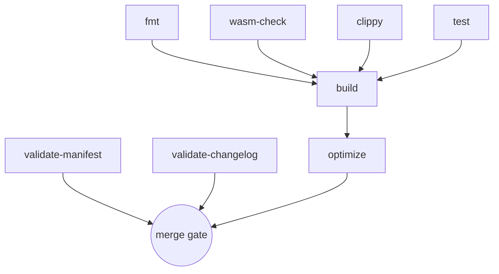

# CI/CD Pipeline

This document describes the GitHub Actions pipeline defined in
[`.github/workflows/ci.yml`](../.github/workflows/ci.yml): what every job does,
why it exists, the order they run in, and how to reproduce each step locally
before opening a PR.

There is exactly one workflow file. It covers linting, formatting, both build
targets (native test host and `wasm32-unknown-unknown`), the deployment-manifest
and changelog validators, and the optimized-WASM artifact.

---

## 1. Triggers

```yaml
on:
  push:
    branches: [main]
  pull_request:
    branches: [main]
```

| Event | When it runs |
|-------|--------------|
| `push` to `main` | Every merge / direct push to the default branch |
| `pull_request` targeting `main` | Every PR open, and every subsequent push to the PR head |

Feature branches are only built through their PR. There is no scheduled
(`cron`) or manual (`workflow_dispatch`) trigger.

---

## 2. Global environment

```yaml
env:
  CARGO_TERM_COLOR: always
  RUSTFLAGS: "-D warnings"
```

* `CARGO_TERM_COLOR: always` — keeps cargo's coloured output readable in the
  Actions log viewer.
* **`RUSTFLAGS: "-D warnings"`** — this is the important one. It promotes
  **every `rustc` warning to a hard error for every job in the workflow**,
  including `cargo build`, `cargo test`, and the WASM builds — not just clippy.
  A warning anywhere fails CI.

The toolchain is pinned by [`rust-toolchain.toml`](../rust-toolchain.toml)
(`channel = "1.85.0"`, components `rustfmt` + `clippy`, target
`wasm32-unknown-unknown`). Jobs install it explicitly with
`dtolnay/rust-toolchain@1.85.0` so the version is visible in each job and does
not silently drift.

---

## 3. Job graph



`validate-manifest`, `validate-changelog`, `fmt`, `wasm-check`, `clippy`, and
`test` all start in parallel. `build` waits for `fmt`, `clippy`, `test`, and
`wasm-check` (`needs: [fmt, clippy, test, wasm-check]`). `optimize` waits for
`build` (`needs: [build]`). The two Python validators are independent of the
Rust jobs.

A PR is mergeable only when every job is green.

---

## 4. Jobs in detail

### 4.1 `validate-manifest` — Validate Deployment Manifest

```yaml
- uses: actions/checkout@v4
- run: python3 scripts/validate_deployments.py
```

Runs [`scripts/validate_deployments.py`](../scripts/validate_deployments.py) in
its default **schema-only** mode (no network). It checks `deployments.json`
against [`deployments.schema.json`](../deployments.schema.json): required
fields, network names, contract-id format, and WASM-hash format. The
`--verify-onchain` mode (which fetches the deployed WASM hash from Stellar RPC)
is **not** run in CI — it is a manual release-time check.

**Local:** `python3 scripts/validate_deployments.py`

### 4.2 `validate-changelog` — Validate Changelog

```yaml
- uses: actions/checkout@v4
- run: python3 scripts/validate_changelog.py
- run: python3 scripts/test_validate_changelog.py
```

[`scripts/validate_changelog.py`](../scripts/validate_changelog.py) enforces
the [Keep a Changelog 1.1.0](https://keepachangelog.com/en/1.1.0/) conventions
on `CHANGELOG.md`: a `# Changelog` heading, an `## [Unreleased]` section,
`## [X.Y.Z] - YYYY-MM-DD` release headings in descending SemVer order with
non-decreasing-as-you-scroll dates, only the six valid `###` categories, no
empty sections, and a link reference for every version.

The second step runs the validator's own self-tests
(`test_validate_changelog.py`) so a broken validator cannot pass silently.

**Local:**
```bash
python3 scripts/validate_changelog.py
python3 scripts/test_validate_changelog.py
```

### 4.3 `fmt` — Formatting

```yaml
- uses: dtolnay/rust-toolchain@1.85.0
  with:
    components: rustfmt
- run: cargo fmt --all -- --check
```

`cargo fmt --all -- --check` fails (non-zero exit, no files written) if any
file in the workspace is not already rustfmt-clean. No cache — formatting does
not compile anything.

**Local:**
```bash
cargo fmt --all -- --check   # check
cargo fmt --all              # fix
```

### 4.4 `wasm-check` — WASM Build Check (no_std)

```yaml
- uses: dtolnay/rust-toolchain@1.85.0
  with:
    targets: wasm32-unknown-unknown
- run: cargo build -p dongle-contract --target wasm32-unknown-unknown --release
```

An **early** compile of the contract to `wasm32-unknown-unknown` (issue #513).
The contract crate is `#![no_std]`; code that accidentally pulls in `std`
compiles fine on the host target used by `cargo test` but fails for WASM. This
job surfaces that class of error in ~1–2 minutes instead of after the full
test suite. It duplicates the compile in `build` on purpose — fast feedback
first, the full gate later.

**Local:**
```bash
cargo build -p dongle-contract --target wasm32-unknown-unknown --release
```

### 4.5 `clippy` — Linting

```yaml
- uses: dtolnay/rust-toolchain@1.85.0
  with:
    targets: wasm32-unknown-unknown
    components: clippy
- run: cargo clippy -p dongle-contract --target wasm32-unknown-unknown --all-features -- -D warnings
```

Clippy runs against the **WASM target** with **`--all-features`** and
**`-D warnings`** — every clippy lint at warn level or above is a build
failure. Combined with the global `RUSTFLAGS: "-D warnings"`, both `rustc` and
`clippy` diagnostics are fatal. This gate is what keeps the panic-as-DoS
remediation in [`THREAT_MODEL.md`](THREAT_MODEL.md) §4 from regressing.

**Local:**
```bash
cargo clippy -p dongle-contract --target wasm32-unknown-unknown --all-features -- -D warnings
```

### 4.6 `test` — Tests

```yaml
- uses: dtolnay/rust-toolchain@1.85.0
  with:
    targets: wasm32-unknown-unknown
- run: cargo test -p dongle-contract
```

Runs the full suite (unit + integration tests under
`dongle-smartcontract/src/tests/`) on the **native host target**. Soroban
contract tests execute against the SDK's in-memory host
(`soroban-sdk` `testutils` feature), which is not available on
`wasm32-unknown-unknown` — so tests are native, and WASM correctness is
covered separately by `wasm-check` / `build`.

`RUSTFLAGS: "-D warnings"` applies here too: a warning in test code fails the
job.

Coverage of contract functions by these tests is tracked in
[`TEST_COVERAGE.md`](TEST_COVERAGE.md), and the test-file layout in
[`TEST_ORGANIZATION.md`](TEST_ORGANIZATION.md).

**Local:** `cargo test -p dongle-contract` (or `cargo test --lib` from
`dongle-smartcontract/`).

### 4.7 `build` — Build Contract

```yaml
needs: [fmt, clippy, test, wasm-check]
- run: cargo build -p dongle-contract --target wasm32-unknown-unknown --release
```

The real build gate. Produces
`target/wasm32-unknown-unknown/release/dongle_contract.wasm` under the release
profile from `Cargo.toml` (`opt-level = "z"`, `lto = true`,
`codegen-units = 1`, `overflow-checks = true`, `panic = "abort"`,
`strip = "symbols"`). Only runs once the four fast gates pass.

**Local:**
```bash
cargo build -p dongle-contract --target wasm32-unknown-unknown --release
```

### 4.8 `optimize` — Optimize WASM

```yaml
needs: [build]
env:
  STELLAR_CLI_VERSION: 27.1.0
```

Steps:

1. Install the Rust toolchain + WASM target.
2. Download the **prebuilt** Stellar CLI release tarball (v27.1.0) and prepend
   it to `PATH`. It is *not* `cargo install`ed: the published `stellar-cli`
   crate now requires a rustc newer than the pinned 1.85.0, so building from
   source fails. The prebuilt binary bundles `wasm-opt`.
3. `stellar --version` sanity check.
4. Rebuild the release WASM.
5. `bash scripts/optimize_wasm.sh` — runs `stellar contract optimize` (falls
   back to `wasm-opt -Oz` if only Binaryen is present) and reports the
   before/after byte size.
6. Upload `dongle_contract.optimized.wasm` as the **`dongle_contract_optimized`**
   artifact (`actions/upload-artifact@v4`).

**Local:**
```bash
cargo build -p dongle-contract --target wasm32-unknown-unknown --release
bash scripts/optimize_wasm.sh
```

---

## 5. Build targets covered

| Target | Job(s) | Purpose |
|--------|--------|---------|
| `wasm32-unknown-unknown` (release) | `wasm-check`, `build`, `optimize` | The artifact that gets deployed. `no_std` correctness, size profile. |
| Native host (`cargo test`) | `test` | Runs the test suite against the `soroban-sdk` in-memory host — `testutils` is host-only. |
| Native host (`cargo clippy` is WASM-target; `fmt` is target-agnostic) | `clippy`, `fmt` | Lint + style. |

Both targets are exercised on every PR. There is no separate "native release
build" because the contract is never run natively in production — only tested.

---

## 6. Caching

`wasm-check`, `clippy`, `test`, `build`, and `optimize` each use
`actions/cache@v4` over `~/.cargo/registry`, `~/.cargo/git`, and `target`,
keyed by:

```
${{ runner.os }}-<job>-${{ hashFiles('rust-toolchain.toml', 'Cargo.lock', 'dongle-smartcontract/Cargo.lock') }}
```

with a `${{ runner.os }}-<job>-` restore-key prefix so a partial hit still
warms the cache when only source (not dependencies) changed. Each job has its
own cache namespace to avoid cross-job `target/` corruption. `fmt` and the two
Python validators are uncached.

---

## 7. Reproduce the whole pipeline locally

From the repository root:

```bash
# Python validators
python3 scripts/validate_deployments.py
python3 scripts/validate_changelog.py
python3 scripts/test_validate_changelog.py

# Rust gates (mirror CI exactly)
export RUSTFLAGS="-D warnings"
cargo fmt --all -- --check
cargo build -p dongle-contract --target wasm32-unknown-unknown --release   # wasm-check + build
cargo clippy -p dongle-contract --target wasm32-unknown-unknown --all-features -- -D warnings
cargo test -p dongle-contract

# Artifact
bash scripts/optimize_wasm.sh
```

Shortcuts:

* [`docs/TESTING.md`](TESTING.md) has a copy-paste `run_tests.sh` /
  `run_tests.ps1`.
* `dongle-smartcontract/Makefile`: `make ci` runs `check lint test`;
  `make dev` runs `fmt lint test build`. Note `make ci` uses `cargo check`
  (not the full WASM release build) and does not export `RUSTFLAGS=-D warnings`,
  so it is a lighter local approximation, not a 1:1 mirror of the workflow.

---

## 8. Code coverage

`ci.yml` does **not** currently produce a coverage report. Coverage is measured
out-of-band and documented in [`TEST_COVERAGE.md`](TEST_COVERAGE.md):

```bash
cd dongle-smartcontract
cargo install cargo-tarpaulin        # once
cargo tarpaulin --lib --out Xml --out Html --output-dir ../coverage
```

`cargo tarpaulin` runs on the native target (same as `cargo test`) and is the
supported tool for this crate; `cargo llvm-cov` also works. Adding a
non-blocking `coverage` job that uploads the tarpaulin report as an artifact is
tracked as a follow-up (see `TEST_COVERAGE.md` §Roadmap).

---

## 9. Change policy

* Keep jobs pinned to explicit action versions (`@v4`) and the toolchain to the
  `rust-toolchain.toml` channel. Bump both deliberately, in their own PR.
* Any new job that compiles Rust must set up the toolchain with
  `dtolnay/rust-toolchain@<channel>` and add a cache entry with its own
  namespace.
* Do not remove `RUSTFLAGS: "-D warnings"` or the `-D warnings` on clippy.
* When you add a job, update §3 (job graph) and §4 of this document in the same
  PR.

---

**Last Updated:** 2026-08-27
**Workflow:** [`.github/workflows/ci.yml`](../.github/workflows/ci.yml)
**Related docs:** [`TESTING.md`](TESTING.md), [`TEST_COVERAGE.md`](TEST_COVERAGE.md), [`TEST_ORGANIZATION.md`](TEST_ORGANIZATION.md), [`DEPLOYMENT.md`](../DEPLOYMENT.md)
