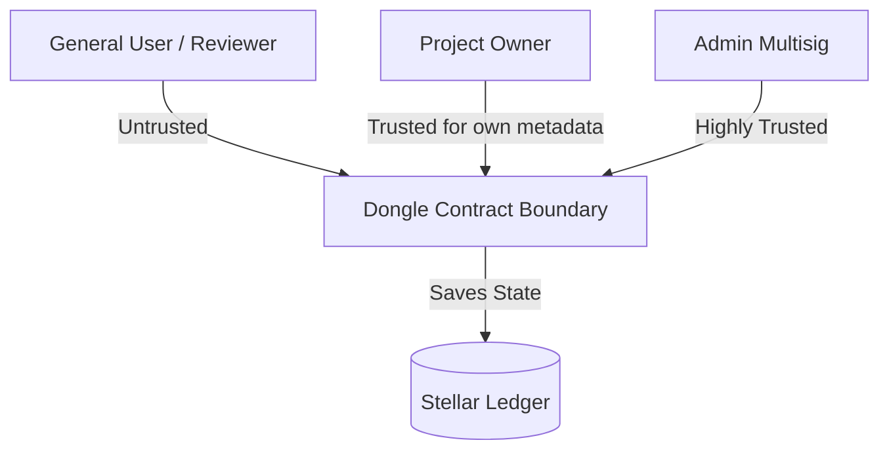

# Dongle Smart Contract Threat Model

This document outlines the security architecture, trust assumptions, assets, actors, threat analysis, and mitigations for the Dongle smart contract.

---

## 1. System Assets

1. **Project Registry State:** The integrity of project ownership, names, slugs, and associated metadata (website, description, tags, social links).
2. **Review & Rating Data:** The validity of reviews, individual ratings, aggregated statistics (average ratings, total counts), and flag counts.
3. **Escrowed / Paid Fees:** Token balances paid for registration or verification, held in the contract or directed to the configured treasury.
4. **Administrative Credentials:** The set of authorized admin addresses and the parameters governing multisig execution thresholds and timelocks.

---

## 2. Actors & Trust Boundaries

* **Project Owner:** An external Stellar account that registers a project. Trusted only to modify their own project metadata.
* **Reviewer / General User:** Any external Stellar account that reads/writes reviews, follows, or bookmarks projects. Untrusted.
* **Admins:** A set of trusted accounts authorized to manage contract configuration and perform moderation. Trust is distributed across multiple admins using an on-chain multisig proposal system.
* **Smart Contract Boundary:** All entry points validate authentication via `Address::require_auth()`.



---

## 3. Threat Analysis & Abuse Cases

### A. Impersonation and Metadata Tampering
* **Threat:** An attacker registers a project using the name/slug of a popular external project to divert traffic or conduct phishing. Or, a hacker modifies metadata of an existing legitimate project.
* **Mitigation:** 
  - `require_auth()` prevents unauthorized metadata changes. Only the registered project owner (or authorized maintainers) can invoke `update_project`.
  - **Uniqueness Constraints:** Slugs and names are verified for uniqueness upon registration and updates. Once a slug is registered, it cannot be claimed by another project.
  - **Verified Field Freezing:** Once a project is verified by admins (`VerificationStatus::Verified`), its identity-critical fields (`name`, `slug`, `category`, `logo_cid`, `metadata_cid`) are frozen. They cannot be updated by the owner unless the verification is revoked first.

### B. Spam and Sybil Attacks
* **Threat:** An attacker registers thousands of fake projects or writes thousands of fake reviews to skew averages, manipulate rankings, or bloat ledger state.
* **Mitigation:**
  - **Registration & Verification Fees:** Admins can configure non-zero fee requirements for registration and verification to make spam financially expensive.
  - **Ownership Limits:** A strict limit (`MAX_PROJECTS_PER_USER`) restricts the number of active projects a single Stellar address can register.
  - **Moderation:** Admins can flag and hide/delete reviews that are determined to be abusive or spam. General users can report reviews to trigger admin inspection.

### C. Admin Abuse and Collusion
* **Threat:** A compromised or malicious admin single-handedly alters fee rates, routes treasury funds to a private key, or falsely approves/revokes project verifications.
* **Mitigation:**
  - **Multisig Governance:** Highly sensitive administrative actions (adding/removing admins, changing fees, setting thresholds) cannot be executed by a single admin. They require submitting a formal `AdminProposal` and gathering approvals up to a defined threshold (`threshold`).
  - **Timelock Delay:** Changes to critical parameters (like fee configuration updates) require scheduling via a timelock, introducing a delay that allows users to notice and react before changes take effect.

---

## 4. Panic-as-Denial-of-Service (DoS) Risk

### 4.1 Threat Description

A panic inside a Soroban contract aborts the current invocation. Under the
release profile this crate builds with (`panic = "abort"`, see
`dongle-smartcontract/Cargo.toml`), a panic unwinds the whole host call frame
and the transaction fails. This is **not** a persistent contract halt — the
next invocation starts from clean ledger state — but it is still an
availability problem:

* **Griefing / targeted DoS:** if an attacker can craft an input that makes a
  *victim's* transaction panic (for example a paginated getter over a project
  the attacker can influence), the victim's operation can be blocked
  repeatedly at the cost of one failed transaction per attempt.
* **Fee loss:** the victim still pays the Soroban resource fee for the failed
  invocation.
* **Indexer / frontend breakage:** read paths that panic instead of returning
  an empty result force every downstream consumer to special-case the failure.

The risk is only material when a panic site is **reachable from an external
entry point** with **attacker-influenced input or state**. Panics that can
only fire on genuine contract bugs (invariant violations) are lower priority
but are still tracked below.

### 4.2 Panic Site Inventory

The inventory was produced by scanning every non-test module under
`dongle-smartcontract/src/` for `panic!`, `unreachable!`, `todo!`,
`unimplemented!`, `.unwrap()`, `.expect(...)`, `panic_with_error!`, and
unchecked slice / index / arithmetic operations, then tracing each hit back to
the public entry points in `lib.rs` that can reach it.

**Result: there are currently no reachable panic sites in production contract
code.** Every module listed in the original draft has been remediated. The
table below records each historical panic site, where it lived, and how it was
resolved, so that regressions are easy to spot in review.

| # | Module | Historical panic site | Entry point(s) | Attacker-influenced? | Status | Resolution |
|---|--------|-----------------------|----------------|----------------------|--------|------------|
| 1 | `timelock_manager.rs` | `panic!` on future-timestamp / min-delay validation | `schedule_set_fee`, `schedule_add_admin`, `schedule_remove_admin` | Admin-only input | ✅ Resolved | `validate_timelock()` returns `Err(ContractError)` |
| 2 | `timelock_manager.rs` | `unwrap_or_else(\|\| panic!(...))` when action not found | `execute_scheduled_*`, `cancel_scheduled_action` | Action id (public) | ✅ Resolved | `get_action_unchecked()` → `.ok_or(ContractError::InvalidStatus)?` |
| 3 | `timelock_manager.rs` | `panic!` on invalid action state (executed / cancelled / not expired) | `execute_scheduled_*` | Action id (public) | ✅ Resolved | `require_pending()` / `require_expired()` return typed errors |
| 4 | `timelock_manager.rs` | `.expect()` on stored fee / admin-add / admin-remove params | `execute_scheduled_*` | Corrupt storage only | ✅ Resolved | `.ok_or(ContractError::InvalidStatus)?` |
| 5 | `endorsement_registry.rs` | `panic!("project not found")` | `endorse_project`, `unendorse_project` | Project id (public) | ✅ Resolved | `ProjectRegistry::get_project(...).ok_or(ContractError::ProjectNotFound)?` |
| 6 | `bookmark_registry.rs` | `panic!("project not found")` | `bookmark_project`, `unbookmark_project` | Project id (public) | ✅ Resolved | `return Err(ContractError::ProjectNotFound)` |
| 7 | `dependency_registry.rs` | `.unwrap()` on `core::str::from_utf8` of a key buffer (4 sites) | `add_project_dependency`, `update_project_dependency`, `remove_project_dependency`, `get_project_dependencies` | Dep metadata (public) | ✅ Resolved | `.map_err(\|_\| ContractError::InvalidProjectData)?` |
| 8 | `review_registry` (bubble sort) | `all.get(j).unwrap()` / `all.get(j + 1).unwrap()` in sort loop | `list_reviews_sorted` | Review volume (public) | ✅ Resolved | Extracted to `utils::bubble_sort_by`, which uses `if let (Some(a), Some(b))` + `saturating_sub` |
| 9 | `project_registry.rs` (bubble sort) | `all.get(j).unwrap()` / `all.get(j + 1).unwrap()` in sort loop | `list_projects_sorted` | Project volume (public) | ✅ Resolved | Same shared `utils::bubble_sort_by` helper |
| 10 | `admin_manager.rs` | `panic!("Contract already initialized")` | `initialize` | One-shot, pre-auth | ✅ Resolved | `return Err(ContractError::AlreadyInitialized)` |

Remaining `.unwrap()` occurrences in the tree are all inside `#[cfg(test)]`
modules (`src/tests/`, `src/verification_registry/state_machine.rs` test
block) or in doc-comments explaining why a call is safe — none are compiled
into the deployed WASM.

### 4.3 Structural Defences Against New Panic Sites

| Defence | Where | Effect |
|---------|-------|--------|
| Uniform `Result<T, ContractError>` return type | Every state-mutating entry point in `lib.rs` | Errors are values, not aborts; callers get a typed code from `docs/ERROR_CODES.md` |
| `#[repr(u32)] enum ContractError` with 74 variants | `src/errors.rs` | Every failure mode has a dedicated, stable code — no reason to reach for `panic!` |
| `checked_add` / `checked_sub` / `checked_mul` / `saturating_*` (43 call sites) | Rating aggregation, counts, pagination math | Arithmetic returns `ContractError::ArithmeticOverflow` instead of overflow-panicking |
| `overflow-checks = true` in `[profile.release]` | `Cargo.toml` | Any *un*checked arithmetic that slips through still traps deterministically rather than wrapping silently — a defence-in-depth backstop, not the primary control |
| Bounds-safe `Vec` access (`.get()` + `if let Some`) | `utils::bubble_sort_by`, pagination helpers | Out-of-range indices yield `None`, never a panic |
| Slice reads guarded by explicit length checks | `utils.rs` / `dependency_registry.rs` CID parsing | Buffers are validated before slicing; UTF-8 conversion failures map to `ContractError` |
| `wasm-check` + `clippy -D warnings` CI gates | `.github/workflows/ci.yml` | `clippy::unwrap_used`-class regressions surface in review; see `docs/CI_CD.md` |
| `no_std` crate | `#![no_std]` in `lib.rs` | No access to `std` panic machinery / unwind; keeps the panic surface minimal |

### 4.4 Risk Assessment Matrix

Scoring: **Likelihood** and **Impact** are Low / Medium / High. "Residual"
is the risk that remains *after* the resolution in §4.2 and the defences in
§4.3.

| Panic class | Example entry point | Likelihood (pre-fix) | Impact (pre-fix) | Inherent risk | Residual risk | Notes |
|-------------|---------------------|----------------------|------------------|---------------|---------------|-------|
| Not-found lookups (project / action id) | `endorse_project`, `execute_scheduled_set_fee` | High — any caller passes an id | Medium — griefing + fee loss | **High** | **Low** | Now typed `ProjectNotFound` / `InvalidStatus` |
| Malformed-buffer UTF-8 parse | `add_project_dependency` | Medium — needs crafted metadata | Medium — blocks the caller's own write | **Medium** | **Low** | `InvalidProjectData` returned; input length-validated first |
| Sort / pagination out-of-bounds | `list_projects_sorted`, `list_reviews_sorted` | Low — needs an index-bounds bug | High — breaks a public read path for everyone | **Medium** | **Low** | Shared `bubble_sort_by` is bounds-safe by construction |
| Arithmetic overflow in aggregates | `add_review` → stats update | Low — needs ~2³²–2⁶⁴ reviews | Medium — blocks further writes to one project | **Medium** | **Low** | `checked_*` → `ArithmeticOverflow`; `overflow-checks` backstop |
| Re-initialization panic | `initialize` | Low — one-shot, guarded | Low — no funds/state at risk | **Low** | **Low** | `AlreadyInitialized` returned |
| Storage-corruption `.expect()` | `execute_scheduled_*` | Very Low — implies host/ledger fault | Medium | **Low** | **Low** | `.ok_or(...)?`; only reachable if ledger data is already inconsistent |
| Admin-only validation panic | `schedule_set_fee` | Low — requires admin auth | Low — admin can retry | **Low** | **Low** | Typed errors; not attacker-facing |

### 4.5 Remediation Priority & Status

| Priority | Item | State | Follow-up |
|----------|------|-------|-----------|
| P0 | Eliminate all attacker-reachable `panic!` / `unwrap` / `expect` from entry-point paths | ✅ **Done** (items 1–10, §4.2) | Keep the §4.2 table current in every PR that touches a registry module |
| P1 | Enforce `checked_*` arithmetic on all counters and aggregates | ✅ **Done** — 43 call sites, `ArithmeticOverflow` variant | Add a clippy lint (`clippy::arithmetic_side_effects`) to make this mechanical |
| P1 | Bounds-safe shared sort / pagination helpers | ✅ **Done** — `utils::bubble_sort_by`, `pagination.rs` | — |
| P2 | CI lint to forbid new `.unwrap()` / `.expect()` / `panic!` in `src/` (excluding `src/tests/`) | ⬜ **Open** | Add `#![cfg_attr(not(test), deny(clippy::unwrap_used, clippy::expect_used, clippy::panic))]` or a `grep` gate in `ci.yml` |
| P2 | Property-based / fuzz tests that assert "no entry point panics on arbitrary input" | 🟡 **Partial** — `proptest_pagination.rs` covers pagination; other modules rely on unit tests | Extend proptest coverage to dependency-metadata parsing and sorted listings; track in `docs/TEST_COVERAGE.md` |
| P3 | Document panic semantics for integrators (indexers must still tolerate a failed read) | ✅ **Done** — this section + `docs/ERROR_CODES.md` | — |

### 4.6 Regression Guard for Reviewers

When reviewing a PR that touches any `src/*_registry*.rs`, `timelock_manager.rs`,
`admin_manager.rs`, `utils.rs`, or `rating_calculator.rs`, reject the change if it:

1. introduces `panic!`, `unreachable!`, `todo!`, `unimplemented!`, `.unwrap()`,
   or `.expect(...)` outside a `#[cfg(test)]` block;
2. performs bare `+`, `-`, `*` on balances / counts / indices instead of the
   `checked_*` / `saturating_*` forms;
3. indexes a `Vec` / slice with `[i]` or `.get(i).unwrap()` instead of pattern
   -matching on `.get(i)`;
4. adds a public entry point whose signature is not `-> Result<_, ContractError>`
   for any state-mutating operation.

---

## 5. Unresolved Risks & Trust Assumptions

1. **IPFS / Off-Chain Data Availability:** 
   - *Risk:* Review contents, descriptions, and verification evidence are stored as CIDs (IPFS hashes). The contract cannot guarantee that the off-chain content behind these CIDs is pinned, accessible, or matches the schema.
   - *Assumption:* Indexers and frontends must handle missing or slow CID resolution gracefully.
2. **Admin Collusion:**
   - *Risk:* If a threshold of admins colludes, they can override any constraint, approve malicious projects, or arbitrarily set exorbitant fees.
   - *Assumption:* The admin keys are held by separate, independent entities, and their private keys are secured.
3. **Off-Chain Identity Verification Diligence:**
   - *Risk:* Verification approval depends on the manual, off-chain diligence of admins confirming that the requester owns the project. If admins perform poor validation, incorrect verifications can occur.
4. **Soroban Host / SDK Faults:**
   - *Risk:* A panic originating inside `soroban-sdk` or the host (rather than contract code) is outside this contract's control. The `.expect()`-replacement `.ok_or(...)?` sites in §4.2 assume the host returns consistent storage data.
   - *Assumption:* The Stellar validator set and the pinned `soroban-sdk` 22.0.0 behave to spec.

---

## 6. Panic-as-DoS Audit Methodology

To reproduce the §4.2 inventory:

```bash
cd dongle-smartcontract
# Reachable panic surface in production code (should return only comments / test asserts):
grep -rn "panic!\|unreachable!\|todo!\|unimplemented!\|\.unwrap()\|\.expect(" src --include="*.rs" \
  | grep -v "/tests/"
# Checked-arithmetic coverage:
grep -rn "checked_add\|checked_sub\|checked_mul\|saturating_" src --include="*.rs" | grep -v "/tests/" | wc -l
# Confirm every mutating entry point returns Result:
grep -n "pub fn " src/lib.rs
```

Re-run this scan whenever a registry module changes and update the §4.2 table
and §4.5 status column accordingly.

---

**Last Updated:** 2026-08-27
**Scope:** `dongle-contract` v0.6.0, `soroban-sdk` 22.0.0, toolchain 1.85.0
**Related docs:** [`ERROR_CODES.md`](ERROR_CODES.md), [`CI_CD.md`](CI_CD.md), [`TEST_COVERAGE.md`](TEST_COVERAGE.md), [`ARCHITECTURE.md`](ARCHITECTURE.md)
